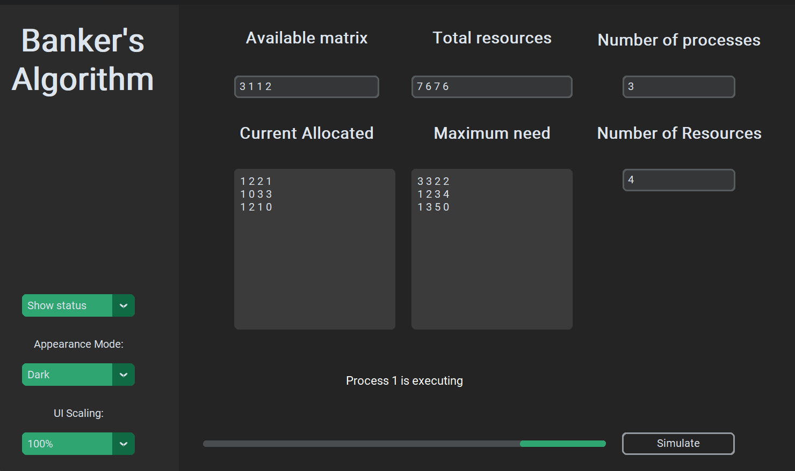
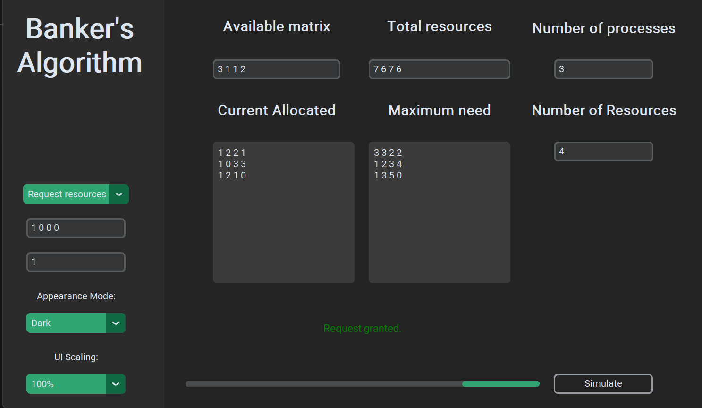

# Banker's Algorithm Visualizer

The Banker's Algorithm Visualizer is a tool that helps demonstrate the Banker's Algorithm, which is used to ensure the safe execution of processes in a resource allocation system.

## Features

- Show the status of the system by checking if it is in a safe state.
- Request additional resources for a specific process and determine if the request can be granted.
- Simulation animation with visual feedback.
- User-friendly graphical user interface.

## Prerequisites

- Python >=3.7
- customtkinter

## Installation

```shell
pip install customtkinter
```


## Screenshots
_Example of the Banker's Algorithm Visualizer in action._



_Checking safe status._



_Abitity to request from resources._
